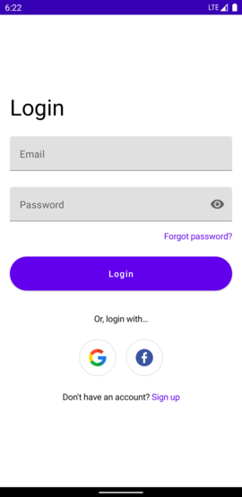
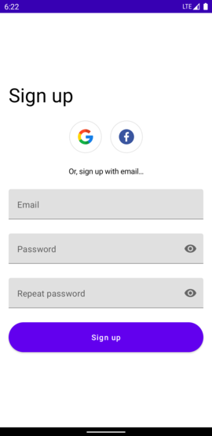
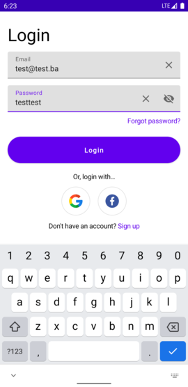
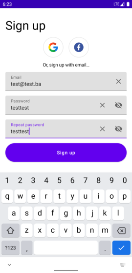
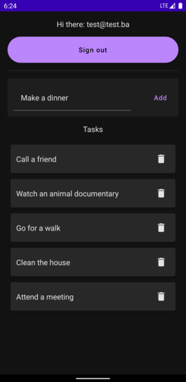
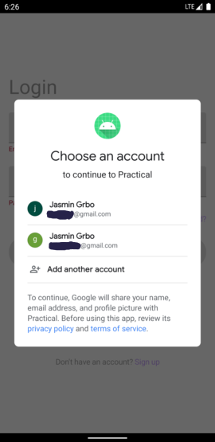
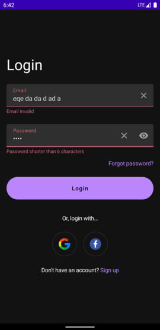

# To-do app with authentication

A simple to-do app with authentication done as an assignment given by a company as a part of the
recruitment process.

The assignment consists of two tasks:
* Practical, make an app with authentication features
* Algorithmic, solve an algorithmic problem

For the sake of simplicity the algorithmic task is included in the practical task in a separate
module named *algorithmic*.

The authentication can be done by using:
* Email and password
* Google account

All sensitive data is included in the project, so that the reviewer can clone the project and
build it immediately without having to worry about setting up everything him/herself.
No harm can be done, since all the sensitive data has been provided through dummy accounts.

Some app screenshots:

